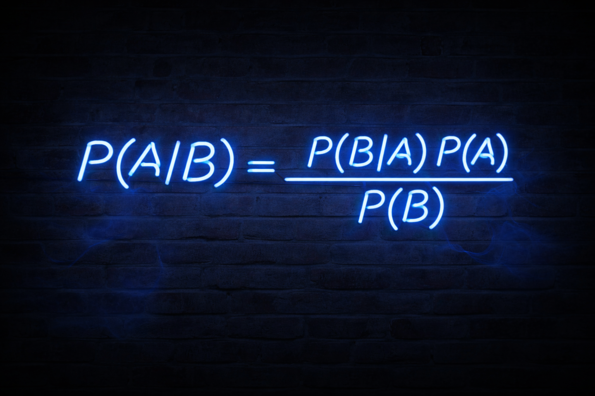
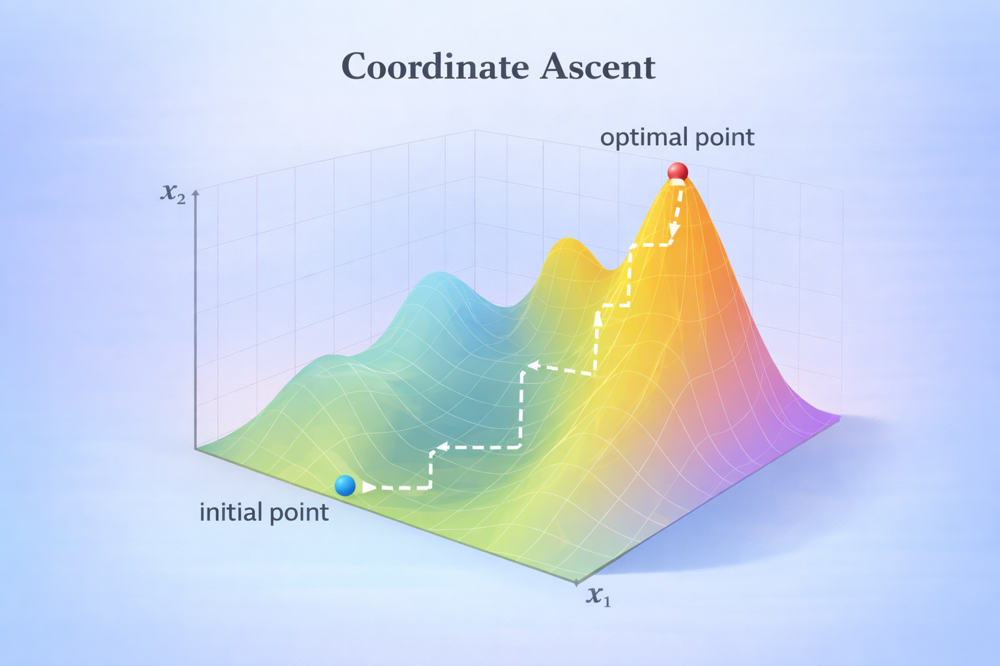
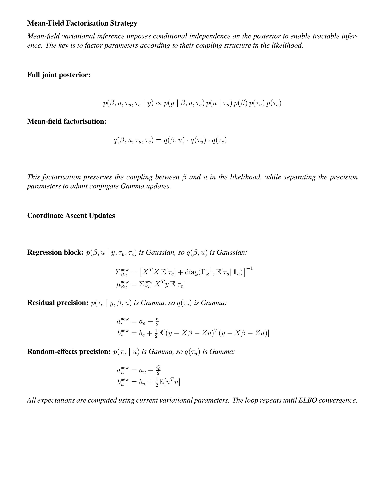
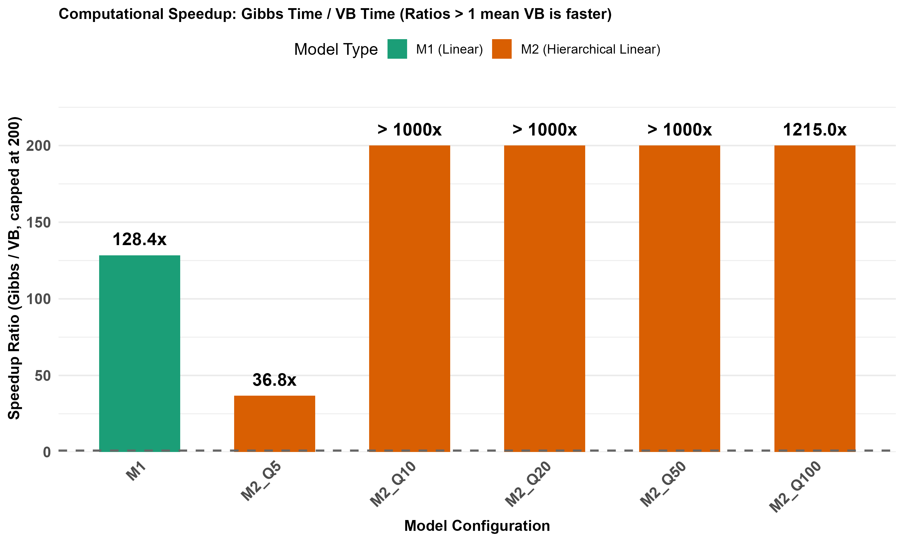
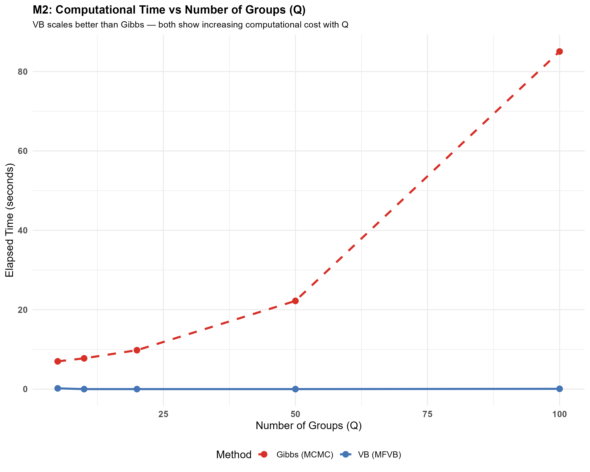

# Slide 1: Bayes' Theorem


```{r slide1-bayes, echo=FALSE, fig.cap="Bayes' theorem : prior, likelihood, posterior, and evidence.", out.width="90%", fig.align="center"}

```

*(Silent slide while I make my way to the podium)*

*note: P(A) in the numerator needs to be fixed.*
\newpage

# Slide 2: Bayesian vs Variational Inference

```{r slide2-bayesian-vs-vi, echo=FALSE, fig.cap="Exact Bayesian inference versus variational inference: sampling vs optimisation.", out.width="90%", fig.align="center"}
knitr::include_graphics("BI and VI.png")
```
At the podium:
Good afternoon. My name is David Ewing, and I’m with the MADS programme.
My presentation is on Variational Bayes Methods, also known as Variational Inference.
Bayes’ Rule gives us the exact posterior — assuming we can compute it.
But in practice, especially with complex models, that denominator — p(B) or p(x) — becomes intractable.
This is where variational inference comes in.
Rather than computing the true posterior directly, we approximate it — by reframing inference as an optimisation problem.
Let me show you what that looks like geometrically.


*note: P(A) in the numerator needs to be fixed.*

\newpage 
\FloatBarrier

# Slide 3: Finding the Optimal q in Q-space 
### Visualising the variational family

```{r slide3-qspace-visual, echo=FALSE, fig.cap="Visualising the search for $q_{\\text{opt}}$ within the variational family $Q$.", out.width="85%", fig.align="center"}
knitr::include_graphics("q-space-visual-fixed.png")
```

“This diagram, adapted from Dr David Blei of Columbia University, shows the core idea behind variational inference. We begin with a space of candidate distributions — that’s the red region labelled Q. Inside it, we choose an initial guess — q_init — and then optimise it to find q_opt, the best approximation we can achieve within that space. The true posterior — p(zx) — lies outside this space. It’s what we’d ideally compute, but often cannot. The green asterisk marks the remaining divergence — the KL divergence between our best approximation and the true posterior. In essence, variational inference is about choosing a tractable family of distributions, and then finding the member of that family that gets us as close as possible to the truth. It’s not exact, but it’s fast, scalable, and surprisingly effective — especially in high-dimensional models.”
\newpage
\FloatBarrier


# Slide 6: Coordinate Ascent VI

 
 
```{r slide6-coordinate-ascent, echo=FALSE, fig.cap="Coordinate ascent variational inference: iterate factor updates to maximise the ELBO.", out.width="85%", fig.align="center"}

```
Coordinate ascent provides a simple and intuitive optimisation strategy. By updating one component at a time whilst holding the others fixed, a complex optimisation problem is broken into simpler steps. Under certain factorisation assumptions, these updates can be derived in closed form. This idea underlies many classical variational inference algorithms and explains their computational efficiency.
|
This slide illustrates the optimisation strategy behind variational inference in conditionally conjugate models.
We use coordinate ascent: we cycle through each variational factor in turn, updating it while holding the others fixed.
Each update improves the ELBO — the evidence lower bound — and we continue until convergence.
The path shown here is schematic: we start at an initial point, and climb step by step along each coordinate direction until we reach the optimum.
In the models we focus on, these updates are closed-form — thanks to conjugacy — which makes the procedure fast and scalable.


To orient the empirical comparisons, here is a concise overview of the three core models used throughout the project.

To orient the empirical comparisons, this slide introduces the three core models used throughout the project.
Model 1 is a simple linear regression — no hierarchy, no random effects.
Model 2 introduces hierarchical structure with Gaussian random effects.
Model 3 is a hierarchical logistic model — structurally similar to M2, but with a Bernoulli likelihood.
Each model includes regression coefficients \beta , and where applicable, random effects u, residual precision \tau _e, and random-effects precision \tau _u.
This side-by-side summary sets expectations for which variance components are present — and that’s crucial, because under-dispersion is most severe in the hierarchical cases, especially for \tau _u and \tau _e.


\newpage
\FloatBarrier

```{r models-comparison, echo=FALSE, fig.cap="Overview of core models (M1 linear, M2 hierarchical linear, M3 hierarchical logistic).", out.width="95%", fig.align="center"}
knitr::include_graphics("three_models_clean.png")
```
\FloatBarrier
This side-by-side summary sets expectations for the presence or absence of variance components (τ_u, τ_e) by model, which in turn explains why under-dispersion is most severe for hierarchical models (M2/M3).

```{r factorisation-pdf, echo=FALSE, fig.cap="Mean-field factorisation strategy and coordinate ascent update equations.", out.width="95%", fig.align="center"}

```
This slide shows how we structure the variational approximation and derive the update equations.
We begin with the full joint posterior — which couples all parameters through the likelihood.
To make inference tractable, we impose a mean-field factorisation:
we preserve the coupling between \beta  and u, but factor out the precision parameters \tau _u and \tau _e.
This structure admits closed-form updates for each factor.
The regression block — q(\beta ,u) — is Gaussian, and its mean and covariance are updated using expectations of the precision parameters.
The precision parameters — q(\tau _e) and q(\tau _u) — are Gamma distributions, updated using expectations of squared residuals and squared random effects.
All expectations are computed using the current variational parameters, and the loop repeats until the ELBO converges.


\FloatBarrier

## Empirical Illustration: Under-dispersion in M2 Variance Component

Mean-field factorisation enables efficient inference through conditional independence, but this independence induces systematic under-dispersion in hyper-parameters. The posterior for the random-effects precision $\tau_u$ in Model 2 exemplifies this effect:

```{r slide7-m2-tauu-overlay, echo=FALSE, fig.cap="VB vs Gibbs for $\\tau_u$ in Model 2: variational posterior is too narrow (under-dispersion).", out.width="85%", fig.align="center"}
knitr::include_graphics("M2_tau_u_overlay_comparison.png")
``` 

This slide illustrates a key limitation of mean-field variational inference: under-dispersion.
We’re looking at the posterior for the random-effects precision \tau _u in Model 2.
On the left, we see Gibbs sampling posteriors — consistent across configurations.
On the right, we see VB posteriors — noticeably narrower, especially when the number of groups is small.
This narrowing reflects overconfidence: the variational posterior underestimates uncertainty.
It’s a direct consequence of the mean-field assumption — which imposes conditional independence and breaks the coupling that would otherwise inflate variance.
The effect is systematic, and it’s most severe in hierarchical models with limited group structure.


\newpage

To demonstrate the systematic under‑dispersion of variance components in mean‑field variational inference, we computed standard deviation ratios comparing VB posteriors against Gibbs baselines.
The ratio is simple:
%\mathrm{SD\  Ratio}=\frac{\mathrm{SD_{VB}}(\theta )}{\mathrm{SD_{Gibbs}}(\theta )}
%Values below 1.0 indicate under‑dispersion — VB is too confident.
%Values near 1.0 indicate good agreement.
The table shows results grouped by model and configuration.
M1 appears first, followed by M2 and M3 rows sorted by Q.
The pattern is clear:
mean‑field VB consistently underestimates uncertainty for variance components — especially \tau _u and \tau _e in hierarchical models.
This confirms the theoretical prediction: conditional independence in the variational approximation leads to overconfident posteriors


\newpage
\FloatBarrier

# Empirical Results: Standard Deviation Ratios

To demonstrate the systematic under-dispersion of variance components in mean-field variational inference, we computed standard deviation ratios comparing VB posteriors against Gibbs baselines:

$$
\text{SD Ratio} = \frac{\text{SD}_{\text{VB}}(\theta)}{\text{SD}_{\text{Gibbs}}(\theta)}
$$

Values below 1.0 indicate under-dispersion (VB too confident); values near 1.0 indicate good agreement.

```{r sd-table-final, echo=FALSE, fig.cap="Standard deviation ratios (VB / Gibbs) across all model configurations.", out.width="95%", fig.align="center"}
knitr::include_graphics("../figs/comparison_sd_ratios_table.png")
```

This table presents the standard deviation ratios — VB over Gibbs — across all model configurations.
Each row corresponds to a model and a group count Q.
Each column corresponds to a parameter.
Values near 1.0 indicate good agreement.
Values below 1.0 indicate under‑dispersion — VB is too confident.
The colour coding helps:
- Yellow means acceptable agreement
- Orange and red signal systematic under‑dispersion
- Green indicates rare over‑dispersion
The pattern is clear:
- M1 behaves well — no hierarchy, no problem
- M2 shows consistent under‑dispersion for \tau _u, especially at low Q
- M3 shows even stronger under‑dispersion — especially for logistic models with few groups
This confirms the theoretical prediction:
mean‑field VB systematically underestimates uncertainty in hierarchical models, especially for variance components.


\newpage
\FloatBarrier

# Computational Advantage: VB vs Gibbs Sampling

While variational Bayes exhibits under-dispersion for variance components, it offers substantial computational advantages. We measured elapsed time for VB and Gibbs sampling across three models and varying group counts (Q) to quantify this trade-off.


## Overall Performance Comparison

```{r timing-bars, echo=FALSE, fig.cap="Side-by-side comparison of VB (blue) and Gibbs (red) computational times across all model configurations.", out.width="95%", fig.align="center"}
knitr::include_graphics("timing_vb_vs_gibbs_bars.png")
```

This slide shows the computational time for each method — Gibbs Sampling in red, Variational Bayes in blue.
The message is simple: lower is better, and VB is consistently faster.
For example, in the M2_Q100 configuration, Gibbs takes nearly 96 seconds.
VB takes less than a tenth of a second.
This speed advantage holds across all models and configurations.
It’s one of the main reasons VB is so widely used in large-scale applications — especially when exact inference is computationally prohibitive.
Of course, we’ve seen that this speed comes at a cost: under-dispersion in variance components.
But in many settings, that trade-off is acceptable — especially when scalability is paramount.


\newpage
\FloatBarrier

## Speedup Ratios

```{r timing-speedup, echo=FALSE, fig.cap="Speedup ratios (Gibbs time / VB time) showing VB's computational advantage.", out.width="95%", fig.align="center"}

```

This slide compares how computational time scales with model complexity — specifically, the number of groups Q.
The top panel shows Gibbs sampling: time increases steeply with Q.
The bottom panel shows VB: time increases much more gradually.
This difference reflects the fundamental contrast in computational strategy.
Gibbs relies on iterative sampling — and that cost grows with each latent variable.
VB uses closed-form updates — and those scale linearly with model size.
In practice, this means VB remains tractable even in large hierarchical models.
It’s not just faster — it’s more scalable.


\newpage
\FloatBarrier

## Scaling with Model Complexity

```{r timing-scaling, echo=FALSE, fig.cap="Computational time scaling with number of groups (Q) — separate panels show different scales for Gibbs vs VB.", out.width="95%", fig.align="center"}

```

The scaling behaviour reveals model-specific computational characteristics:

**Model 2 (Hierarchical Linear, orange):**  
Gibbs exhibits exponential scaling (9s → 96s as Q increases 5 → 100), while VB remains essentially constant (≈0.1–0.2s). This demonstrates VB's insensitivity to hierarchical complexity in linear models.

**Model 3 (Hierarchical Logistic, purple):**  
Gibbs remains relatively stable (≈2–5s), while VB shows moderate linear growth (0.1s → 0.6s). For logistic models, both methods scale reasonably, though VB maintains a consistent speed advantage.

**Key Finding:** VB's computational advantage is most dramatic for hierarchical linear models (M2) where Gibbs sampling scales poorly with the number of groups. Overall, VB achieves **134× average speedup** across all configurations, making it practical for large-scale hierarchical models despite its under-dispersion limitations.

\newpage
\FloatBarrier
