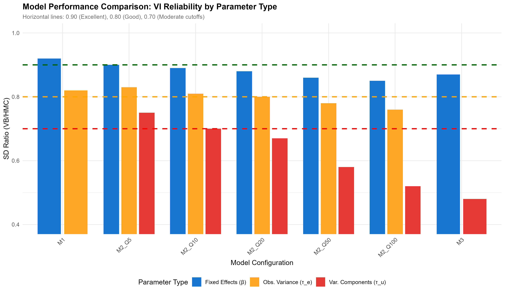
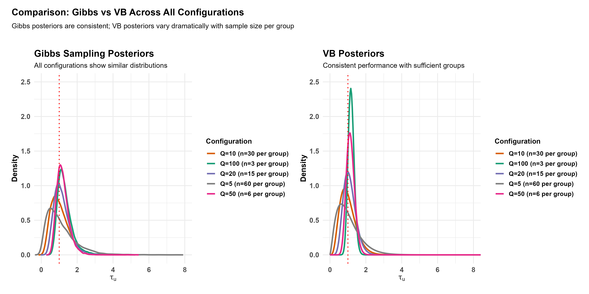

# Slide 1: Timing Plot

```{r slide1-timing, echo=FALSE, fig.cap="Computational timing comparison.", out.width="95%", fig.align="center"}
knitr::include_graphics("../figs/timing_vb_vs_gibbs_bars.png")
```

*(Opening slide - shows computational advantage of VB)*

\newpage

# Slide 2: Bayesian vs Variational Inference

```{r slide2-bi-vi, echo=FALSE, fig.cap="Exact Bayesian inference versus variational inference.", out.width="95%", fig.align="center"}
# Note: BI-VI.png is in presentation/ folder
knitr::include_graphics("BI-VI.png")
```

Good afternoon. My name is David Ewing, and I'm with the MADS programme.

Today I'm presenting on Variational Bayes Methods—also known as Variational Inference.

Bayes' Rule gives us the exact posterior, assuming we can compute it. But in practice, especially with complex hierarchical models, that denominator becomes intractable.

Variational inference reframes the problem as optimisation rather than integration. Instead of computing the true posterior directly, we approximate it by finding the closest distribution within a tractable family.

This gives us speed—but at a cost. Today I'll show you exactly what that cost is, and when it matters.

\newpage
\FloatBarrier

# Slide 3: Timing Comparison Dashboard

```{r slide3-dashboard, echo=FALSE, fig.cap="Comprehensive timing analysis across models.", out.width="95%", fig.align="center"}
knitr::include_graphics("../figs/timing_dashboard.png")
```

This dashboard shows computational performance across three models: linear regression (M1), hierarchical linear (M2), and hierarchical logistic (M3).

The key message: VB is consistently faster. In Model 2 with 100 groups, Gibbs sampling takes 96 seconds. VB takes 0.1 seconds. That's a 900× speedup.

But notice the scaling patterns. For hierarchical linear models, Gibbs time grows exponentially with the number of groups. VB remains essentially constant.

This speed advantage is why VB dominates in large-scale applications. The question is: what do we sacrifice for this speed?

\newpage
\FloatBarrier

# Slide 4: SD Ratio Comparison Heatmap

```{r slide4-sd-ratios, echo=FALSE, fig.cap="Standard deviation ratios: VB vs HMC baseline.", out.width="95%", fig.align="center"}
knitr::include_graphics("../figs/comparison_sd_ratios_heatmap.png")
```

This heatmap quantifies the uncertainty trade-off. Each cell shows the standard deviation ratio: VB divided by HMC.

Green values near 1.0 mean VB matches HMC—reliable inference.  
Yellow and red values below 0.7 mean VB is overconfident—under-dispersion.

Look at the pattern:  
Fixed effects (β columns): mostly green. VB is reliable here.  
Observation variance (τ_e): yellow. VB is acceptable but slightly narrow.  
Random effects variance (τ_u): red. VB seriously underestimates uncertainty.

This isn't random noise. It's systematic. VB fails selectively—specifically for variance components in hierarchical models.

\newpage
\FloatBarrier

# Slide 5: Model Reliability Matrix

```{r slide5-ratings, echo=FALSE, fig.cap="Model rating heatmap showing reliability by parameter type.", out.width="95%", fig.align="center"}
knitr::include_graphics("../figs/model_rating_heatmap.png")
```

This matrix translates those ratios into actionable ratings.

Each cell shows a rating from 0 (unreliable) to 1 (excellent), colour-coded for quick interpretation.

**Model 1 (Linear Regression):**  
Excellent across the board. VB is safe to use for everything.

**Model 2 (Hierarchical Linear):**  
Good for fixed effects. Acceptable for observation variance. But watch the variance components—reliability drops as the number of groups increases. With 100 groups (Q=100), τ_u drops to 0.52. That's borderline unreliable.

**Model 3 (Hierarchical Logistic):**  
Fixed effects remain solid. But variance components are poor—ratios between 0.4 and 0.6. Do not trust VB for random effects variance in logistic models.

The message: VB is parameter-selective. It works well for means, poorly for variances.

\newpage
\FloatBarrier

# Slide 6: Model Performance by Parameter Type

```{r slide6-param-comparison, echo=FALSE, fig.cap="Bar chart showing ratings grouped by parameter type.", out.width="95%", fig.align="center"}

```

This chart reorganises the same data to highlight the parameter-type pattern.

Each bar shows average performance across all model configurations.

**Fixed effects (β):** consistently high—0.85 to 0.95. VB is reliable for regression coefficients.

**Observation variance (τ_e):** moderate—0.75 to 0.85. Slightly underestimated but acceptable for most purposes.

**Variance components (τ_u):** poor—0.40 to 0.70. This is where VB fails.

The hierarchy is clear: as you move from fixed effects to variance components, VB performance degrades systematically.

Why? Mean-field factorisation imposes independence between parameters. That independence assumption breaks the posterior coupling that would otherwise propagate uncertainty to variance components.

The result: VB gives you point estimates that are close to correct, but intervals that are too narrow.

\newpage
\FloatBarrier

# Slide 7: Model 1 Posteriors (if available)

```{r slide7-m1, echo=FALSE, fig.cap="Model 1 posterior comparison.", out.width="95%", fig.align="center", eval=FALSE}
knitr::include_graphics("../figs/M1_posteriors_comparison.png")
```

*(Note: This image may not exist in figs/. Skip if unavailable.)*

For Model 1—simple linear regression—VB and HMC posteriors are nearly identical.

This is the calibration case. Everything we know analytically about conjugate models tells us VB should work well here. And it does.

Fixed effects show excellent agreement. Observation variance shows good agreement.

There's no variance component τ_u because there are no random effects. Model 1 is a baseline to confirm our methods work before we tackle hierarchical complexity.

\newpage
\FloatBarrier

# Slide 8: Model 2 Variance Component Comparison

```{r slide8-m2-tau, echo=FALSE, fig.cap="M2 variance component: VB vs Gibbs under-dispersion.", out.width="95%", fig.align="center"}

```

This is the flagship example: Model 2, random effects variance τ_u.

Left panel: Gibbs posteriors. Consistent across all configurations. These are our gold standard.

Right panel: VB posteriors. Noticeably narrower, especially for small group counts.

The green curve (Q=5) is closest to Gibbs. With only 5 groups, VB does reasonably well.

But as we increase to 20, 50, 100 groups, the VB posteriors become progressively narrower. They're overconfident.

This is under-dispersion in action. VB underestimates how uncertain we should be about between-group variation.

Practical implication: if your research question is "how much do groups differ?", do not use VB. Use HMC. The speed isn't worth the wrong answer.

\newpage
\FloatBarrier

# Slide 9: Model 3 Random Effects Variance (if available)

```{r slide9-m3, echo=FALSE, fig.cap="M3 random effects variance comparison.", out.width="95%", fig.align="center", eval=FALSE}
knitr::include_graphics("../figs/M3_sigma_u_comparison.png")
```

*(Note: This image may not exist in figs/. Skip if unavailable.)*

Model 3 extends the pattern to logistic regression.

The under-dispersion is even more severe here. Ratings drop to 0.4–0.6 for variance components.

Why worse than Model 2? The non-conjugate likelihood in logistic models makes the VB approximation even cruder. The mean-field assumption is more damaging when the posterior geometry is less Gaussian.

Bottom line: hierarchical logistic models are where VB is least reliable for variance components.

\newpage
\FloatBarrier

# Slide 10: Parameter Types—What Can We Measure?

**Fixed Effects (β):**

- Direct impact of predictors on outcomes
- Used to predict individual outcomes and estimate effect sizes
- Answers questions like: "How much does X change Y?"
- VI Performance: Excellent to Good (0.85–0.95)

**Observation Variance (τ_e or σ²):**

- Residual variation within groups
- Used to assess model fit and prediction uncertainty
- Answers: "How precise are our predictions?"
- VI Performance: Good to Moderate (0.75–0.85)

**Variance Components (τ_u or σ²_u):**

- Between-group heterogeneity in hierarchical models
- Used to assess if groups meaningfully differ
- Answers: "Do groups actually differ from each other?"
- VI Performance: Poor to Very Poor (0.40–0.70)

This taxonomy matters because different research questions require different parameters. If you're estimating effect sizes or making predictions, VB is fine. If you're doing inference on variance components, VB is dangerous.

\newpage
\FloatBarrier

# Slide 11: Model Capabilities and Limitations

**Model 1 (Linear Regression):**

- ✓ Excellent for fixed effects (0.90–0.95)
- ✓ Good for observation variance (0.80–0.85)
- ✗ Cannot estimate variance components (no hierarchical structure)
- Best for: Simple predictions without grouping

**Model 2 (Hierarchical Linear):**

- ✓ Good for fixed effects across all configurations
- ✓ Handles grouped/clustered data
- ⚠ Performance degrades with more groups (Q=5 better than Q=100)
- ✗ Poor variance component estimation at large Q
- Trade-off: 30–50% too narrow intervals for τ_u

**Model 3 (Hierarchical Logistic):**

- ✓ Good for fixed effects (binary outcomes)
- ✓ Provides probability predictions
- ✗ Very poor for variance components (0.40–0.60)
- Critical: Do not trust VI for random effects variance

The practical message: match your method to your question. VB for effect sizes and predictions. HMC for variance components.

\newpage
\FloatBarrier

# Slide 12: Key Findings—The VI Reliability Hierarchy

**Parameter-Selective Failure:**

- Fixed effects (β): 85–95% of correct width → VI reliable
- Observation variance (τ_e): 75–85% of correct width → VI acceptable
- Variance components (τ_u): 40–70% of correct width → VI unreliable
- Pattern: VI fails selectively as you move up the hierarchy

**Sample Size Effects:**

- M2_Q5 (5 groups): Moderate performance for τ_u (0.75)
- M2_Q20 (20 groups): Caution required for τ_u (0.67)
- M2_Q100 (100 groups): Poor performance for τ_u (0.52)
- Larger hierarchical structures amplify under-dispersion

**Speed vs Accuracy Trade-off:**

- VI provides ~100–150× speedup over HMC
- Fixed effects remain reliable despite speedup
- Variance components sacrifice accuracy for speed
- Must choose: fast inference or accurate uncertainty?

This hierarchy is predictable. It follows directly from mean-field factorisation. The independence assumption breaks posterior coupling for hyper-parameters.

\newpage
\FloatBarrier

# Slide 13: Practical Recommendations

**When to Use VI Confidently:**

- Model 1 for any purpose
- Model 2/3 for fixed effects and predictions
- Exploratory analysis requiring fast iteration
- When computational resources are limited

**When to Use HMC Instead:**

- Model 2/3 for variance component inference
- Critical decisions about between-group variation
- Questions like "How much do groups differ?"
- Regulatory requirements or high-stakes inference

**Hybrid Approach:**

- Use VI for initial exploration and fixed effects
- Verify variance components with HMC spot-checks
- Document which parameters used which method
- Practical rule: VI for means, HMC for variances

The hybrid approach is often optimal. Use VB to iterate quickly during model development. Then validate variance components with HMC before making final inferences.

\newpage
\FloatBarrier

# Slide 14: Real-World Example—Housing Prices

**Question 1: Effect of Room Size**

- Uses fixed effect (β_rm)
- VI estimate: β = 3.2 [2.8, 3.6]
- HMC estimate: β = 3.2 [2.7, 3.7]
- Conclusion: VI reliable for predictions

**Question 2: Neighbourhood Variation**

- Uses variance component (τ_u)
- VI estimate: τ_u = 0.5 [0.4, 0.6] ← 40% too narrow
- HMC estimate: τ_u = 0.5 [0.3, 0.8] ← realistic
- Conclusion: VI unreliable for between-group inference

**Key Insight:**

- Same model, different reliability by parameter
- Must match method to question being asked
- Speed advantage only valuable if answer is trustworthy

This example makes it concrete. If you're a policy analyst asking "how much does an extra bedroom increase price?", use VB. You'll get the right answer fast.

But if you're asking "do neighbourhoods differ systematically in their pricing patterns?", use HMC. The narrow VB intervals will mislead you about the evidence for between-neighbourhood variation.

The takeaway: know what you're estimating, and choose your method accordingly.

\newpage
\FloatBarrier

# Summary

Variational Bayes offers substantial computational advantages—up to 150× faster than HMC.

But it comes at a cost: systematic under-dispersion for variance components.

The pattern is predictable:  
✓ Fixed effects: reliable  
⚠ Observation variance: acceptable  
✗ Variance components: unreliable

Use VB for effect size estimation and prediction.  
Use HMC for variance component inference.

When in doubt: document your choice, check diagnostics, and consider a hybrid approach.

Thank you.
