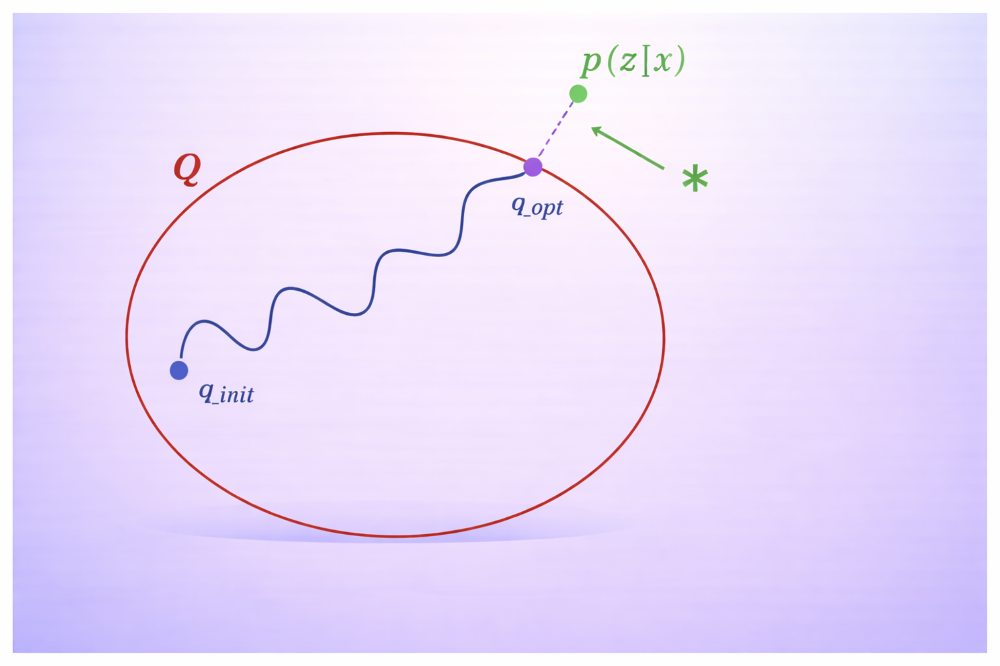
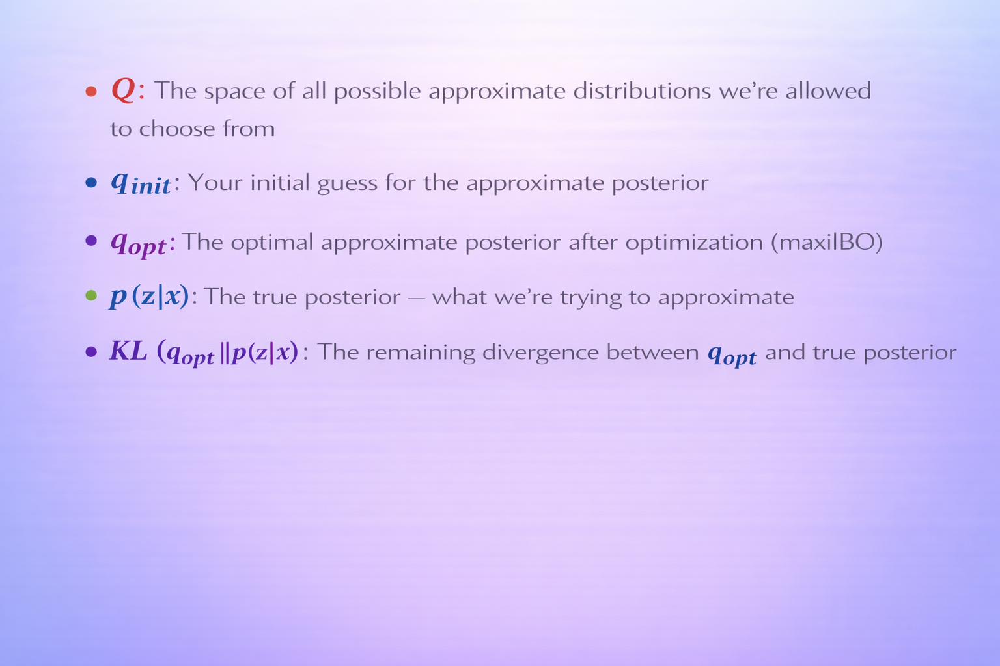
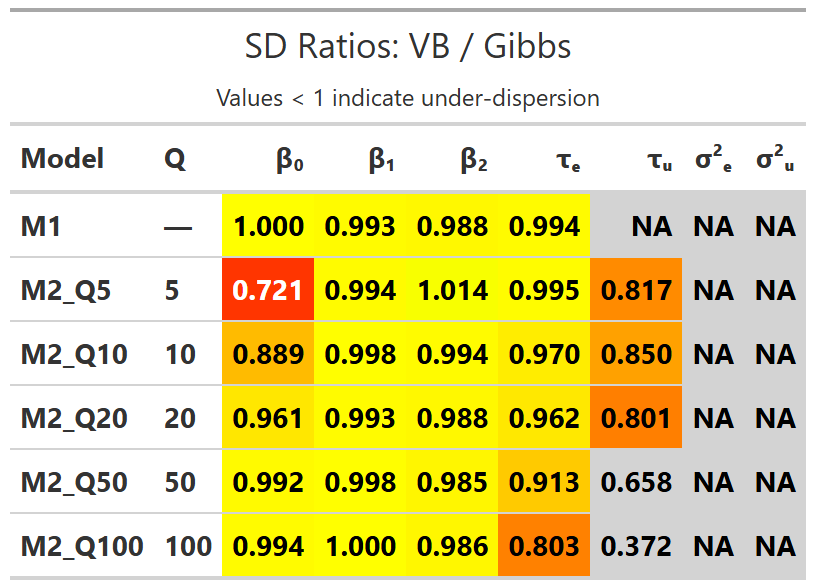

# Slide 1: Bayes' Theorem

Bayesian inference updates prior beliefs with evidence via Bayes' theorem. This slide introduces the core identity that underpins all subsequent approximations.

```{r slide1-bayes, echo=FALSE, fig.cap="Bayes' theorem refresher: prior, likelihood, posterior, and evidence.", out.width="90%", fig.align="center"}
knitr::include_graphics("Bayesian.png")
```

# Slide 2: Bayesian vs Variational Inference

This side-by-side view contrasts exact Bayesian inference with variational inference (VI), highlighting the optimisation perspective that trades sampling for speed.

```{r slide2-bayesian-vs-vi, echo=FALSE, fig.cap="Exact Bayesian inference versus variational inference: sampling vs optimisation.", out.width="90%", fig.align="center"}
knitr::include_graphics("BI and VI.png")
```

# Slide 3: Finding the Optimal q in Q-space

We search over a family $Q$ to find $q_{\text{opt}}$ that minimises $KL(q \parallel p)$. The visual emphasises the geometry of the approximation problem.

```{r slide3-qspace-visual, echo=FALSE, fig.cap="Visualising the search for $q_{\text{opt}}$ within the variational family $Q$.", out.width="85%", fig.align="center"}

```

Key definitions used in the figure:

- $Q$: space of admissible variational distributions
- $q_{\text{init}}$: starting guess
- $q_{\text{opt}}$: optimiser of the ELBO
- $p(z\mid x)$: true posterior
- $KL(q_{\text{opt}} \parallel p)$: residual divergence at optimum

# Slide 4: Q-space at a Glance

The bullet view summarises the optimisation landscape and the KL objective that drives the search within $Q$.

```{r slide4-qspace-bullets, echo=FALSE, fig.cap="Bullet summary of the variational family $Q$ and optimisation targets.", out.width="85%", fig.align="center"}

```

# Slide 5: Conditionally Conjugate Models

Many models of interest admit tractable complete conditionals (exponential family), enabling closed-form variational updates. This slide introduces that class, distinguishing global and local latent variables.

```{r slide5-conjugate-models, echo=FALSE, fig.cap="Conditionally conjugate models: examples that admit exponential-family complete conditionals.", out.width="75%", fig.align="center"}
knitr::include_graphics("models_score_gradient.png")
```

In these models, global variables influence all observations, while local variables are specific to each data point. Conjugacy ensures each complete conditional stays in the exponential family, making coordinate ascent updates closed-form and efficient.

# Slide 6: Coordinate Ascent VI

Coordinate ascent variational inference cycles through each factor in turn, updating it given expectations of the others and climbing the ELBO until convergence.

```{r slide6-coordinate-ascent, echo=FALSE, fig.cap="Coordinate ascent variational inference: iterate factor updates to maximise the ELBO.", out.width="85%", fig.align="center"}
knitr::include_graphics("coordinate_ascent.png")
```

# Slide 7: Under-dispersion in a Variance Component (M2)

Mean-field factorisation tends to underestimate variance components. Here, the VB posterior for $\tau_u$ (random-effects precision) is narrower than the Gibbs reference, illustrating under-dispersion.

```{r slide7-m2-tauu-overlay, echo=FALSE, fig.cap="VB vs Gibbs for $\\tau_u$ in Model 2: variational posterior is too narrow (under-dispersion).", out.width="80%", fig.align="center"}
knitr::include_graphics("M2_tau_u_overlay_comparison.png")
```

To orient the empirical comparisons, here is a concise overview of the three core models used throughout the project.

```{r models-comparison, echo=FALSE, fig.cap="Overview of core models (M1 linear, M2 hierarchical linear, M3 hierarchical logistic).", out.width="95%", fig.align="center"}
knitr::include_graphics("three_models_comparison.pdf")
```

This side-by-side summary sets expectations for the presence or absence of variance components (τ_u, τ_e) by model, which in turn explains why under-dispersion is most severe for hierarchical models (M2/M3).

```{r factorisation-pdf, echo=FALSE, fig.cap="Mean-field factorisation strategy and coordinate ascent update equations.", out.width="95%", fig.align="center"}
knitr::include_graphics("why_factorisation.pdf")
```

# Empirical Results: Standard Deviation Ratios

To demonstrate the systematic under-dispersion of variance components in mean-field variational inference, we computed standard deviation ratios comparing VB posteriors against MCMC baselines:

$$
\text{SD Ratio} = \frac{\text{SD}_{\text{VB}}(\theta)}{\text{SD}_{\text{MCMC}}(\theta)}
$$

Values below 1.0 indicate under-dispersion (VB too confident), values near 1.0 indicate good agreement.

```{r sd-table-final, echo=FALSE, fig.cap="Standard deviation ratios (VB / Gibbs) with Q column and parameters ordered: β₀, β₁, β₂, σ²ᵤ, σ²ₑ, τᵤ, τₑ.", out.width="95%", fig.align="center"}

```

The table presents the numerical ratios grouped by model and Q. Rows are ordered as requested (M1 first, then M2 sorted by Q, then M3 sorted by Q; M0 removed). Parameters are ordered to highlight the variance components (σ²ᵤ, σ²ₑ) before the precisions (τᵤ, τₑ). Values below 1.0 indicate under-dispersion; values near 1.0 indicate good agreement.
