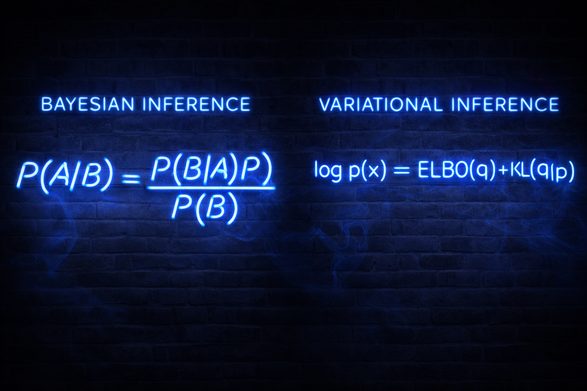
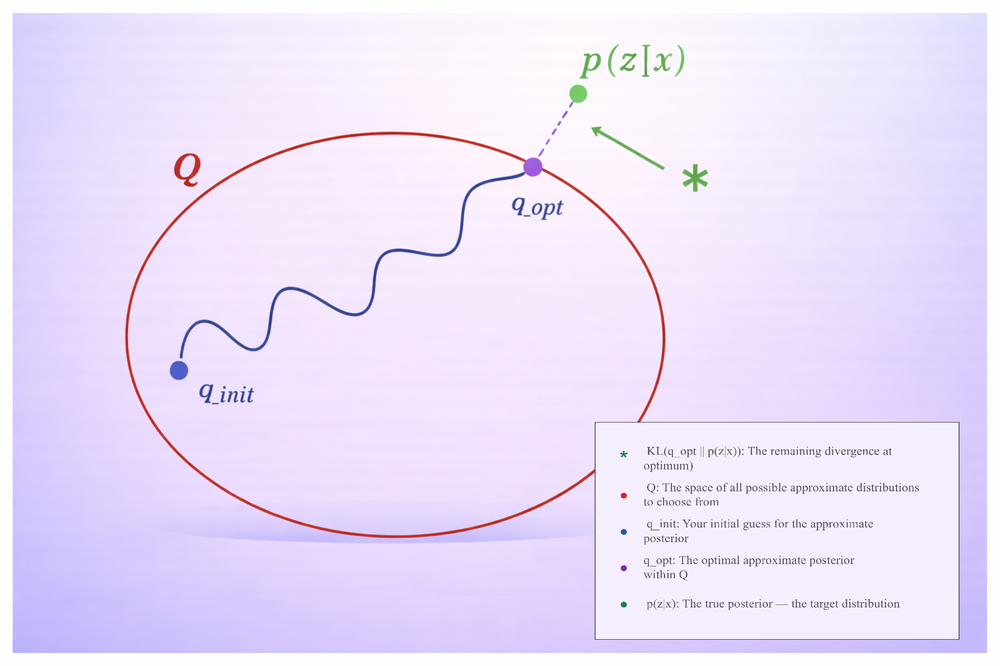
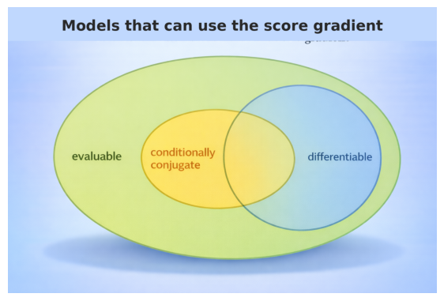

# Slide 1: Bayes' Theorem

Bayesian inference updates prior beliefs with evidence via Bayes' theorem. This slide introduces the core identity that underpins all subsequent approximations.

```{r slide1-bayes, echo=FALSE, fig.cap="Bayes' theorem refresher: prior, likelihood, posterior, and evidence.", out.width="90%", fig.align="center"}
knitr::include_graphics("Bayesian.png")
```
Introduction slide: no narrative
note: P(A) in the numerator needs to be fixed. \newpag

# Slide 2: Bayesian vs Variational Inference

This side-by-side view contrasts exact Bayesian inference with variational inference (VI), highlighting the optimisation perspective that trades sampling for speed.
At the podium: Good afternoon.  My name is David Ewing, and I’m with the MADS programme.
My presentation is on Variational Bayes Methods, also known as Variational Inference.
Bayes’ Rule gives us the exact posterior — assuming we can compute it. But in practice, especially with complex models, that denominator — p(B) or p(x) — becomes intractable.
This is where variational inference comes in.
Rather than computing the true posterior directly, we approximate it — by reframing inference as an optimisation problem.
Let me show you what that looks like geometrically.
note: P(A) in the numerator needs to be fixed

```{r slide2-bayesian-vs-vi, echo=FALSE, fig.cap="Exact Bayesian inference versus variational inference: sampling vs optimisation.", out.width="90%", fig.align="center"}

```
At the podium: Good afternoon.  My name is David Ewing, and I’m with the MADS programme.
My presentation is on Variational Bayes Methods, also known as Variational Inference.
Bayes’ Rule gives us the exact posterior — assuming we can compute it. But in practice, especially with complex models, that denominator — p(B) or p(x) — becomes intractable.
This is where variational inference comes in.
Rather than computing the true posterior directly, we approximate it — by reframing inference as an optimisation problem.
Let me show you what that looks like geometrically.

note: P(A) in the numerator needs to be fixed
# Slide 3: Finding the Optimal q in Q-space

“This diagram, adapted from David Blei, illustrates the core idea behind variational inference. We begin with a space of candidate distributions — that’s the red region labelled Q. Inside it, we choose an initial guess — q_init — and then optimise it to find q_opt, the best approximation we can achieve within that space. The true posterior — p(zx) — lies outside this space. It’s what we’d ideally compute, but often cannot. The green asterisk marks the remaining divergence — the KL divergence between our best approximation and the true posterior. In essence, variational inference is about choosing a tractable family of distributions, and then finding the member of that family that gets us as close as possible to the truth. It’s not exact, but it’s fast, scalable, and surprisingly effective — especially in high-dimensional models.”


We search over a family $Q$ to find $q_{\text{opt}}$ that minimises $KL(q \parallel p)$. The visual emphasises the geometry of the approximation problem.

```{r slide3-qspace-visual, echo=FALSE, fig.cap="Visualising the search for $q_{\text{opt}}$ within the variational family $Q$ (with bullet summary).", out.width="85%", fig.align="center"}

```

Key definitions used in the figure:

- $Q$: space of admissible variational distributions
- $q_{\text{init}}$: starting guess
- $q_{\text{opt}}$: optimiser of the ELBO
- $p(z\mid x)$: true posterior
- $KL(q_{\text{opt}} \parallel p)$: residual divergence at optimum

# Slide 5: Conditionally Conjugate Models

Many models of interest admit tractable complete conditionals (exponential family), enabling closed-form variational updates. This slide introduces that class, distinguishing global and local latent variables.

```{r slide5-conjugate-models, echo=FALSE, out.width="80%", fig.align="center"}

```

In these models, global variables influence all observations, while local variables are specific to each data point. Conjugacy ensures each complete conditional stays in the exponential family, making coordinate ascent updates closed-form and efficient.

# Slide 6: Coordinate Ascent VI

Coordinate ascent variational inference cycles through each factor in turn, updating it given expectations of the others and climbing the ELBO until convergence.
Coordinate ascent variational inference cycles through each factor in turn, updating it given expectations of the others and climbing the ELBO until convergence.
```{r slide6-coordinate-ascent, echo=FALSE, fig.cap="Coordinate ascent variational inference: iterate factor updates to maximise the ELBO.", out.width="85%", fig.align="center"}
knitr::include_graphics("coordinate_ascent.png")
```

To orient the empirical comparisons, here is a concise overview of the three core models used throughout the project.

```{r models-comparison, echo=FALSE, fig.cap="Overview of core models (M1 linear, M2 hierarchical linear, M3 hierarchical logistic).", out.width="95%", fig.align="center"}
knitr::include_graphics("three_models_clean.pdf")
```

This side-by-side summary sets expectations for the presence or absence of variance components (τ_u, τ_e) by model, which in turn explains why under-dispersion is most severe for hierarchical models (M2/M3).

```{r factorisation-pdf, echo=FALSE, fig.cap="Mean-field factorisation strategy and coordinate ascent update equations.", out.width="95%", fig.align="center"}
knitr::include_graphics("why_factorisation_trim.png")
```

## Empirical Illustration: Under-dispersion in M2 Variance Component

Mean-field factorisation enables efficient inference through conditional independence, but this independence induces systematic under-dispersion in hyper-parameters. The posterior for the random-effects precision $\tau_u$ in Model 2 exemplifies this effect:

```{r slide7-m2-tauu-overlay, echo=FALSE, fig.cap="VB vs Gibbs for $\\tau_u$ in Model 2: variational posterior is too narrow (under-dispersion).", out.width="85%", fig.align="center"}
knitr::include_graphics("M2_tau_u_overlay_comparison.png")
```

# Empirical Results: Standard Deviation Ratios

To demonstrate the systematic under-dispersion of variance components in mean-field variational inference, we computed standard deviation ratios comparing VB posteriors against Gibbs baselines:

$$
\text{SD Ratio} = \frac{\text{SD}_{\text{VB}}(\theta)}{\text{SD}_{\text{Gibbs}}(\theta)}
$$

Values below 1.0 indicate under-dispersion (VB too confident); values near 1.0 indicate good agreement.
The table presents standard deviation ratios grouped by model and Q. Rows are ordered with M1 first, followed by M2 rows sorted by Q, then M3 rows sorted by Q (M0 removed). Parameter columns follow the order: β₀, β₁, β₂, σ²_u, σ²_e, τ_u, τ_e. Values below 1.0 indicate under-dispersion; values near 1.0 indicate good agreement. This empirical pattern confirms the theoretical prediction: mean-field VB systematically underestimates uncertainty for variance components in hierarchical models.
and this seems to eand too early so I am assuming a capacity issue


```{r sd-table-final, echo=FALSE, fig.cap="Standard deviation ratios (VB / Gibbs) across all model configurations.", out.width="95%", fig.align="center"}
knitr::include_graphics("../figs/comparison_sd_ratios_table.png")
```

The table presents standard deviation ratios grouped by model and Q. Rows are ordered with M1 first, followed by M2 rows sorted by Q, then M3 rows sorted by Q (M0 removed). Parameter columns follow the order: β₀, β₁, β₂, σ²_u, σ²_e, τ_u, τ_e. Values below 1.0 indicate under-dispersion; values near 1.0 indicate good agreement. This empirical pattern confirms the theoretical prediction: mean-field VB systematically underestimates uncertainty for variance components in hierarchical models.

